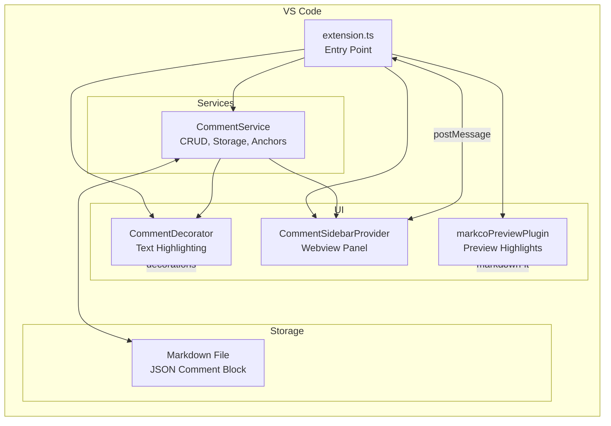

# Interactive Markdown Commenting Extension (Markco)

A VS Code extension that enables inline commenting in Markdown files with a dedicated comment sidebar for navigation and management. Uses VS Code's native text editor with `TextEditorDecorationType` for highlighting, a `WebviewViewProvider` for the sidebar panel, and a markdown-it plugin for preview highlighting.

## Architecture Overview

```ascii
┌─────────────────────────────────────────────────────────────┐
│                    VS Code Window                           │
├──────────────────────────────────┬──────────────────────────┤
│     Native Text Editor           │   Comment Sidebar        │
│  ┌────────────────────────────┐  │  (WebviewViewProvider)   │
│  │ # My Document              │  │  ┌─────────────────────┐ │
│  │                            │  │  │ Comments (2)    X   │ │
│  │ This is [highlighted text] │◄─┼──│ ┌─────────────────┐ │ │
│  │ with a comment.            │  │  │ │ "Review this"   │ │ │
│  │                            │  │  │ │ On: "highligh.."│ │ │
│  │ <!-- markco-comments       │  │  │ └─────────────────┘ │ │
│  │ { "comments": [...] }      │  │  │ ┌────────────────┐  │ │
│  │ -->                        │  │  │ │ "Check grammar"│  │ │
│  └────────────────────────────┘  │  │ └────────────────┘  │ │
│   TextEditorDecorationType       │  └─────────────────────┘ │
└──────────────────────────────────┴──────────────────────────┘
```

## Components



## Steps

1. **Initialize extension project structure** with:
   - [package.json](package.json) - Extension manifest with `views`, `viewsContainers`, commands, activation events
   - [src/extension.ts](src/extension.ts) - Main activation, register providers and commands
   - Commands: `markco.addComment`, `markco.deleteComment`, `markco.editComment`, `markco.toggleSidebar`, `markco.navigateToComment`
   - Activation: `onLanguage:markdown`

2. **Create CommentService** in [src/services/CommentService.ts](src/services/CommentService.ts):
   - `parseComments(document)` - Extract JSON from `<!-- markco-comments ... -->` block
   - `saveComments(document, comments)` - Serialize and write JSON block to end of file
   - `addComment(document, selection, content)` - Create new comment with anchor
   - `deleteComment(document, commentId)` - Remove comment by ID (cascade deletes replies)
   - `updateComment(document, commentId, content)` - Edit comment text
   - `findComment(document, commentId)` - Look up a comment by ID
   - `resolveComment(document, commentId)` - Toggle resolved status of a comment
   - `reAnchorComment(document, commentId, selection)` - Re-anchor an orphaned comment to new selection
   - `addReply(document, commentId, content)` - Add a reply to an existing comment
   - `deleteReply(document, commentId, replyId)` - Remove a reply from a comment
   - `updateReply(document, commentId, replyId, content)` - Edit reply text
   - `findReply(document, commentId, replyId)` - Look up a reply by ID
   - `toggleThumbsUp(document, commentId, replyId?)` - Add or remove current user's thumbs up on a comment or reply
   - `reconcileAnchors(document)` - Re-match anchors after document edits
   - `getGitUserName(document)` - Get Git user.name for author field
   - `sanitizeForStorage()` / `restoreFromStorage()` - Handle `-->` in text to prevent breaking HTML comment block

3. **Create CommentDecorator** in [src/decorators/CommentDecorator.ts](src/decorators/CommentDecorator.ts):
   - `TextEditorDecorationType` for comment highlights (background color, border)
   - `applyDecorations(editor, comments)` - Set decoration ranges from comment anchors
   - `clearDecorations(editor)` - Remove all decorations
   - Listen to `onDidChangeTextDocument` to update decorations in real-time

4. **Create CommentSidebarProvider** in [src/providers/CommentSidebarProvider.ts](src/providers/CommentSidebarProvider.ts):
   - Implements `WebviewViewProvider` for sidebar panel
   - Renders comment list with HTML/CSS (no React needed for MVP)
   - Renders nested replies under each comment
   - Handles messages: `navigateToComment`, `deleteComment`, `editComment`, `resolveComment`, `addReply`, `editReply`, `deleteReply`, `addComment`, `submitNewComment`, `reAnchorComment`, `toggleThumbsUp`
   - `refresh()` method to update view when comments change
   - `focusComment()` method to highlight and scroll to a comment
   - `showAddCommentForm()` method to show the new comment form
   - Toggle to show/hide resolved comments
   - Author-based edit permissions (only own comments/replies editable)
   - Orphaned comment indicators with re-anchor button

5. **Implement two-way navigation**:
   - Sidebar → Editor: On comment click, use `editor.revealRange()` + flash decoration
   - Editor → Sidebar: On text selection, command `markco.addComment` opens sidebar form (auto-selects word/line if no selection)
   - Use `vscode.commands.executeCommand` for cross-component communication

6. **Wire up event listeners** in [src/extension.ts](src/extension.ts):
   - `onDidChangeActiveTextEditor` - Refresh decorations and sidebar
   - `onDidChangeTextDocument` - Reconcile anchors, update decorations
   - `onDidSaveTextDocument` - Persist any pending anchor updates

### Comment Storage Format

Comments are stored as a JSON block at the end of the Markdown file, wrapped in an HTML comment to remain invisible when rendered:

```markdown
<!-- markco-comments
{
  "version": 2,
  "comments": [
    {
      "id": "uuid-string",
      "anchor": {
        "text": "highlighted text snippet",
        "startLine": 10,
        "startChar": 5,
        "endLine": 10,
        "endChar": 28
      },
      "content": "The actual comment text",
      "author": "username",
      "createdAt": "2026-01-15T10:30:00Z",
      "resolved": false,
      "orphaned": false,
      "thumbsUp": ["alice", "bob"],
      "replies": [
        {
          "id": "reply-uuid",
          "content": "Reply text here",
          "author": "reviewer",
          "createdAt": "2026-01-15T11:00:00Z",
          "updatedAt": "2026-01-15T11:30:00Z",
          "thumbsUp": ["alice"]
        }
      ]
    }
  ]
}
-->
```

**Benefits:**

- Main Markdown content stays clean and readable
- Single file - portable, works with Git
- Structured JSON is easy to parse/validate
- Hidden in HTML comment - invisible in rendered output
- Position anchoring via line number + character offsets

**Anchor reconciliation:** When document is edited, anchors are re-matched by searching for the `anchor.text` snippet near the stored line number, updating offsets as needed.

### Thumbs Up Reactions

Comments and replies support thumbs up reactions to indicate agreement or acknowledgment:

- **Data structure:** `thumbsUp` array stores usernames of users who reacted
- **Toggle behavior:** Clicking thumbs up adds current user; clicking again removes them
- **Display:**
  - Single reaction: Shows 👍 icon
  - Multiple reactions: Shows 👍 with count badge (e.g., "👍 3")
  - Tooltip: Lists all users who gave thumbs up (e.g., "alice, bob, charlie")
- **Permissions:** Any user can add/remove their own thumbs up

### File Structure

```ascii
markco/
├── package.json
├── tsconfig.json
├── src/
│   ├── extension.ts              # Activation, command registration, event handlers
│   ├── types.ts                  # Comment, Anchor, Reply, SidebarMessage interfaces
│   ├── services/
│   │   └── CommentService.ts     # Parse, save, CRUD operations, anchor reconciliation
│   ├── decorators/
│   │   └── CommentDecorator.ts   # TextEditorDecorationType management
│   ├── providers/
│   │   └── CommentSidebarProvider.ts  # WebviewViewProvider with 12 callback parameters
│   ├── markdown/
│   │   └── markcoPreviewPlugin.ts    # markdown-it plugin for preview highlighting
│   └── test/
│       └── suite/                # Test files for all components
└── media/
    ├── sidebar.css               # Sidebar styling
    ├── preview.css               # Preview highlighting styles
    └── markco.png                # Extension icon
```

<!-- markco-comments
{
  "version": 2,
  "comments": [
    {
      "id": "202ba2e2-78e6-410e-9274-33c4069fac71",
      "anchor": {
        "text": "A VS Code extension that enables inline commenting in Markdown files with a dedicated comment sidebar for navigation and management. Uses VS Code's native text editor with `TextEditorDecorationType` for highlighting, a `WebviewViewProvider` for the sidebar panel, and a markdown-it plugin for preview highlighting.",
        "startLine": 2,
        "startChar": 0,
        "endLine": 2,
        "endChar": 314
      },
      "content": "Nice overview",
      "author": "Oren Maoz",
      "createdAt": "2026-01-22T10:36:15.701Z",
      "resolved": true,
      "updatedAt": "2026-01-22T13:08:07.491Z"
    },
    {
      "id": "7c2fe2ce-8732-46b8-be07-020eb1c86d32",
      "anchor": {
        "text": "Check grammar\"",
        "startLine": 19,
        "startChar": 43,
        "endLine": 19,
        "endChar": 57
      },
      "content": "What does it mean?",
      "author": "Oren Maoz",
      "createdAt": "2026-01-22T10:47:31.744Z"
    },
    {
      "id": "4081a9db-609c-48c6-add3-f07a16b6259d",
      "anchor": {
        "text": "CommentService",
        "startLine": 33,
        "startChar": 16,
        "endLine": 33,
        "endChar": 30
      },
      "content": "Is this the right place to add the configuration and settings for Marcko?",
      "author": "Oren Maoz",
      "createdAt": "2026-01-22T11:29:21.246Z"
    },
    {
      "id": "9061e712-71a8-45c7-b913-1b56ec720731",
      "anchor": {
        "text": "[package.json](package.json)",
        "startLine": 64,
        "startChar": 5,
        "endLine": 64,
        "endChar": 33
      },
      "content": "Make sure Dave review this file",
      "author": "Oren Maoz",
      "createdAt": "2026-01-22T13:08:33.236Z"
    }
  ]
}
-->
